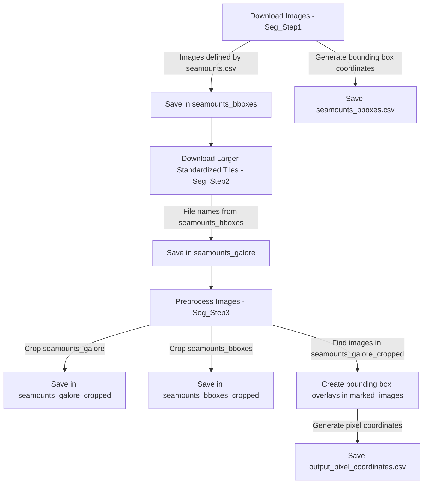

# Workflow for Image Segmentation (Pre-Processing only as of 20241222)

1st step: A specified number of images is downloaded by the script "Seg_Step1". These images are defined by the position and covered area stated in `seamounts.csv` (so they contain zoomed-in images focused on the seamount based on the area stated in km²). These images are saved in "seamounts_bboxes" and produce a `seamounts_bboxes.csv` file with the bounding box geographical coordinates. (Note: This is not sufficient for Image Segmentation, as Image Segmentation needs pixel coordinates.)

2nd step: The script "Seg_Step2" downloads larger, standardized tiles (60nm x 60nm) based on the file names contained in `seamounts_bboxes` and saves them in the folder "seamounts_galore".

3rd step: The preprocessing part of the script "Seg_Step3" crops the images from "seamounts_galore" and "seamounts_bboxes" (Note: The folders have to be specified, and the script must be executed twice for this to happen). The cropped files are saved in "seamounts_galore_cropped" and "seamounts_bboxes_cropped", respectively.

4th step: The main part of "Seg_Step3" creates images with bounding box overlays in the folder "marked_images" by finding the images in "seamounts_bboxes_cropped" within the images in "seamounts_galore_cropped". It also produces an `output_pixel_coordinates.csv` file for later use in Image Segmentation.
