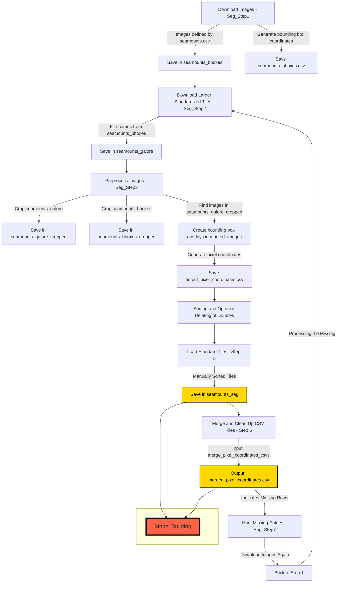
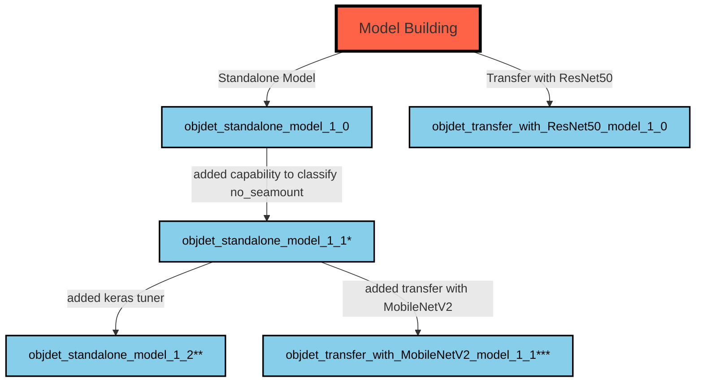
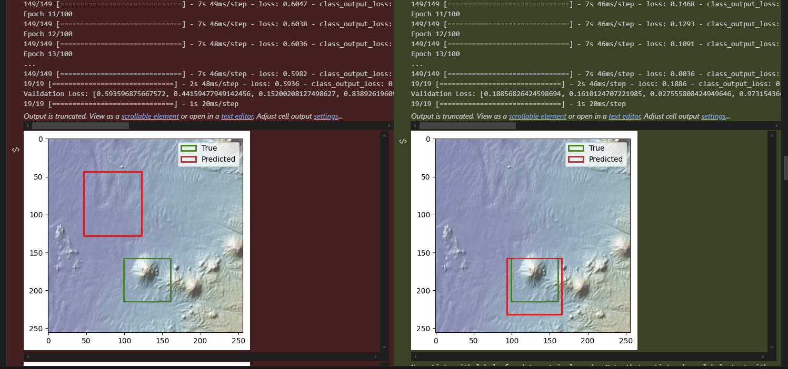

# Workflow for Seamount Image Processing

1st step: A specified number of images is downloaded by the script "Seg_Step1". These images are defined by the position and covered area stated in `seamounts.csv` (so they contain zoomed-in images focused on the seamount based on the area stated in km²). These images are saved in "seamounts_bboxes" and produce a `seamounts_bboxes.csv` file with the bounding box geographical coordinates. (Note: This is not sufficient for Image Segmentation, as Image Segmentation needs pixel coordinates.)

2nd step: The script "Seg_Step2" downloads larger, standardized tiles (60nm x 60nm) based on the file names contained in `seamounts_bboxes` and saves them in the folder "seamounts_galore".

3rd step: The preprocessing part of the script "Seg_Step3" crops the images from "seamounts_galore" and "seamounts_bboxes" (Note: The folders have to be specified, and the script must be executed twice for this to happen). The cropped files are saved in "seamounts_galore_cropped" and "seamounts_bboxes_cropped", respectively.

4th step: The main part of "Seg_Step3" creates images with bounding box overlays in the folder "marked_images" by finding the images in "seamounts_bboxes_cropped" within the images in "seamounts_galore_cropped". It also produces an `output_pixel_coordinates.csv` file for later use in Image Segmentation.

Step 5: Sorting and (optional) delete any doubles. Step 5: Load standard tiles for the manually sorted tiles. These are stored in "seamounts_seg".

Step 6: merge and clean up .csv files. The input folder for this is "merge_pixel_coordinates_csvs" and the output file is: "merged_pixel_coordinates.csv" If rows are missing it is indicated in the output.

Step 7 is hunting missing entries if applicable. "Seg_Step7" downloads these images again (like in step 1) from there on an arrow named "processing the missing" should again go to step 2.

\* Steps in Hyperparameter-Tuning:
- Higher resolution: no significant positive change

- Higher Batch size(32): Takes a lot longer, not significantly better, validation MAE a bit better

- back to batch size 16

- Smaller learning rate(0.0001): worse

- higher learning rate(0.01): Takes very long. Doesn't work at all.

- learning rate scheduler: no positive change

- batch normalization: Takes longer, weird results, cannot really interpret if it's good or not, but bounding box prediction seems to be worse (lot more 0 IoUs)

- more complex model: Of course takes longer, visibly better results with a positive impact especially on the IoU. Best model so far
Changes Summary for this step:

    Convolutional Layers: Added more convolutional layers (256 and 512 filters).
    Fully Connected Layers: Added two fully connected layers (1024 and 512 units) for deeper decision-making.
    MaxPooling Layers: Max pooling layers were added after each convolution to reduce spatial dimensions.
    Dropout Layers: Added additional dropout layers to help prevent overfitting.

- k-fold cross validation: Failed with batch size 16 due to GPU ressource error (is already on best GPU environment available to me). Try with batch size 8 also ressource exhausted. Try with image size 128x128, runs, results not significantly better but could be explored further.

- when trying to revert to previous model configuration I noticed that while the code text can be exactly the same, the model can be built entirely different, like here:

- after copying the previous .ipynb from the git history I did not have this problem again, maybe there was something different in the script after all.

- kept status quo as version 1_1 and continued exploration on version 1_2

\*\*

- keras tuner: Does it only run 2 epochs? If yes then loss will still be very high, does that make sense? First trial hyperband:2 max:100 interrupted due to error RAM again.Reduced image size (128x128). Reduced batch size (8). Custom data generator for loading images in batches. Limited the hyperparameter search space to reduce memory consumption. Clearing the Keras session after training to release memory. Now it runs, but this runs forever... after the first 100 iterations (~45min) it switches from 2 to 4 epochs. Aborted, takes too long and uncertain output (due to image size reduction or ending in an error after running 12h, etc.) Probably is a powerful tool but takes too long to just let it run, maybe explore later within very specific bounds so that it doesn't try everything but only certain hyperparameters?

- even more layers?: tried once, had worse results

- Attention Mechanism: Add an attention layer (e.g., SEBlock or Spatial Attention):

- L2 Regularization:

- Non-Maximum Suppression (NMS):

- Image augmentation (in images with object it would need to modify the box as well, this I didn't manage so far)

- In other models: Ensemble Models, Transfer Learning, Model that can output more than one seamount.

\*\*\*

- MobileNetV2, integration of this Transfer Learning strategy had worse results than the standalone model, maybe could be tweaked

- ResNet50 produced memory error first and then Kernel and program crashes, so abandoned

- maybe transfer learning with normal image recognition models is not so easily applicable to topographical/bathygraphical data