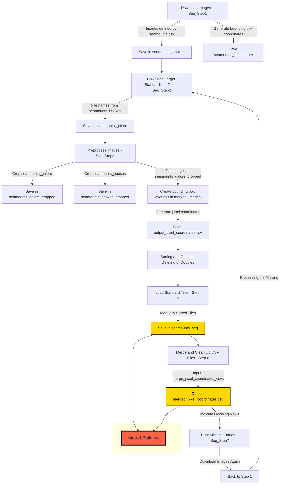

# Workflow for Seamount Image Processing


1st step: A specified number of images is downloaded by the script "Seg_Step1". These images are defined by the position and covered area stated in `seamounts.csv` (so they contain zoomed-in images focused on the seamount based on the area stated in km²). These images are saved in "seamounts_bboxes" and produce a `seamounts_bboxes.csv` file with the bounding box geographical coordinates. (Note: This is not sufficient for Image Segmentation, as Image Segmentation needs pixel coordinates.)

2nd step: The script "Seg_Step2" downloads larger, standardized tiles (60nm x 60nm) based on the file names contained in `seamounts_bboxes` and saves them in the folder "seamounts_galore".

3rd step: The preprocessing part of the script "Seg_Step3" crops the images from "seamounts_galore" and "seamounts_bboxes" (Note: The folders have to be specified, and the script must be executed twice for this to happen). The cropped files are saved in "seamounts_galore_cropped" and "seamounts_bboxes_cropped", respectively.

4th step: The main part of "Seg_Step3" creates images with bounding box overlays in the folder "marked_images" by finding the images in "seamounts_bboxes_cropped" within the images in "seamounts_galore_cropped". It also produces an `output_pixel_coordinates.csv` file for later use in Image Segmentation.

Step 5: Sorting and (optional) delete any doubles. Step 5: Load standard tiles for the manually sorted tiles. These are stored in "seamounts_seg".

Step 6: merge and clean up .csv files. The input folder for this is "merge_pixel_coordinates_csvs" and the output file is: "merged_pixel_coordinates.csv" If rows are missing it is indicated in the output.

Step 7 is hunting missing entries if applicable. "Seg_Step7" downloads these images again (like in step 1) from there on an arrow named "processing the missing" should again go to step 2.

```mermaid
graph TD
    %% Start with Model Building at the top
    R[Model Building]

    %% Add arrows from Model Building to the two new models
    R -->|Standalone Model| S[objdet_standalone_model_1_0]
    R -->|Transfer with ResNet50| T[objdet_transfer_with_ResNet50_model_1_0]

    %% Style for Model Building
    style R fill:#ff6347,stroke:#000,stroke-width:4px, font-size:20px

    %% Style for the new models with black text
    style S fill:#87CEEB,stroke:#000,stroke-width:2px, color:#000
    style T fill:#87CEEB,stroke:#000,stroke-width:2px, color:#000
